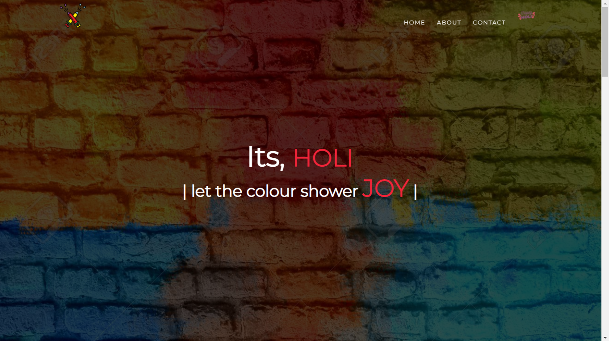
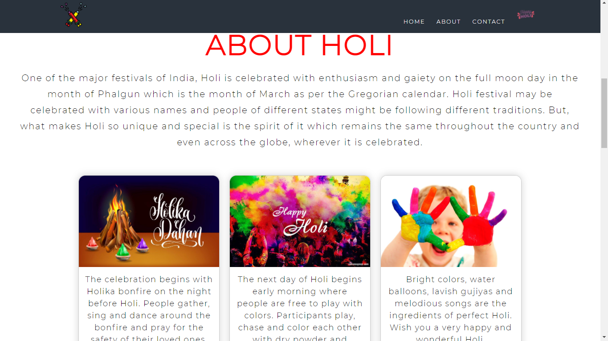
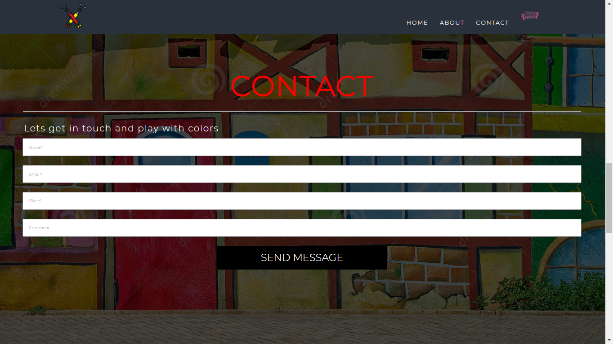
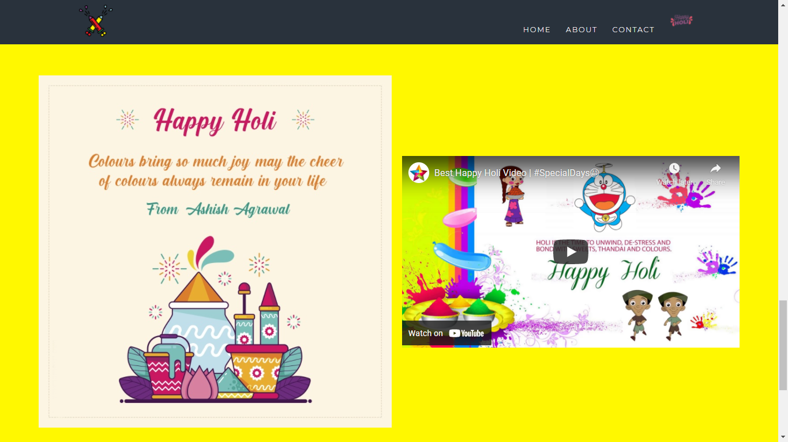

## Hi, I'm Ashish! 👋

# Holi-Vista (Full page website)  

It a blog kind full page website that describes what Holi-Festival is, the significance, and the reason behind celebrating
the holi-festival.
- Holi is a popular Indian festival, also known as the "Festival of Love", the "Festival of Colours" and the "Festival of Spring".
- Holi celebrates the arrival of spring, the end of winter, the blossoming of love and for many, it is a festive day to meet others, play and laugh, forget and forgive, and repair broken relationships.
- Holi celebrations start on the night before Holi with a Holika Dahan. The next morning is celebrated as Rangwali Holi (Dhuleti) – a free-for-all festival of colours, where people smear each other with colours and drench each other.

## 🛠 Skills Needed:
HTML, CSS, Javascript.

## Screenshots

## Links:
- View and Share Holi Greentings: <a href="https://www.youtube.com/watch?v=xAfE4mnQAe8&list=PLgYeW9CyccvLszjWdhhqCz8jq21nEAYkf&index=1" target="_blank">Happy Holi #specialDays</a>

## 🚀 About Me
I'm a full stack & Front-end Developer, I'm a curious learner and always gives my ideas a wings to fly. 
You can follow me on <a href="https://ww.github.com/afirestriker">GitHub</a>, <a href="https://www.linkedin.com/in/ashish-agrawal-india">Linkedin</a>, <a href="https://www.twitter.com/_afirestriker">Twitter</a>, or watch and subscibe me on <a href="https://www.youtube.com/specialdays">Youtbe/SpecialDays</a>
